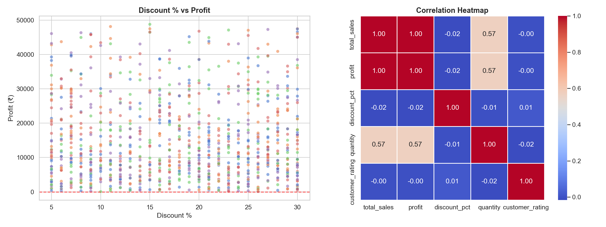
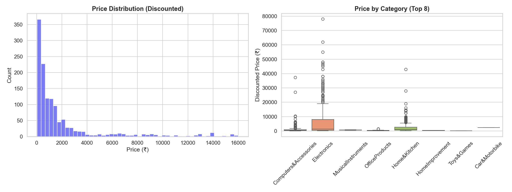
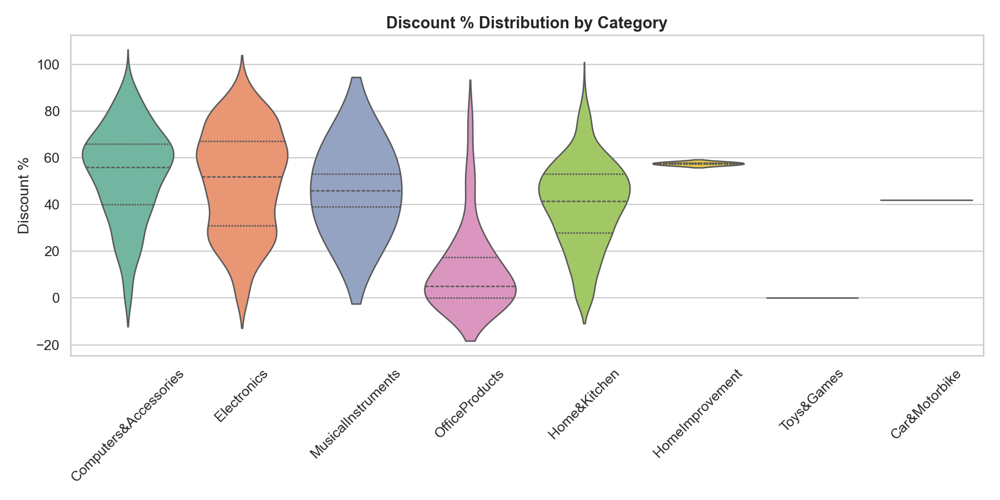
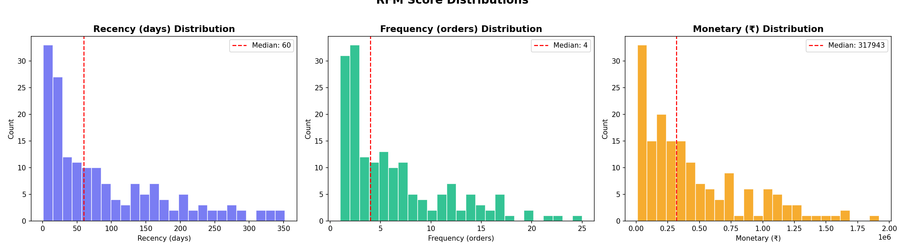
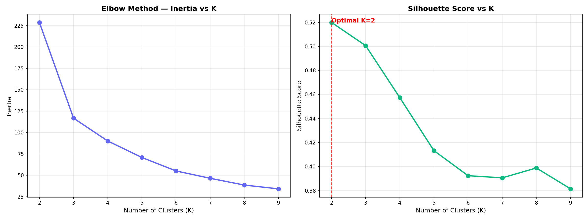
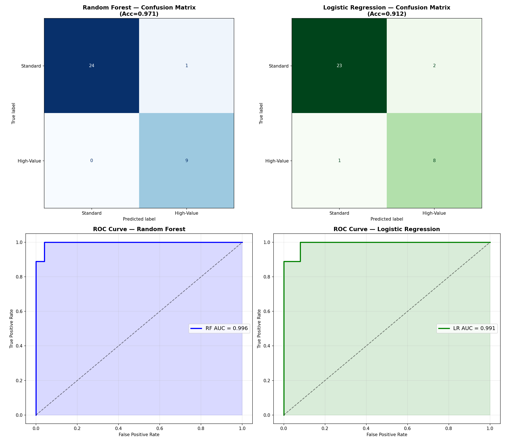

<p align="center">
  <h1 align="center">🛒 E-Commerce Customer Behavior Analysis</h1>
  <p align="center">
    <b>Amazon + Flipkart | EDA · RFM · Clustering · ML Prediction · Streamlit Dashboard</b>
  </p>
  <p align="center">
    
    
    
    
    
  </p>
</p>

---

## 📌 Overview

An **end-to-end data science portfolio project** analyzing customer purchasing behavior across **Amazon** and **Flipkart** e-commerce platforms. The project goes from raw data to actionable insights through a full analytics pipeline — data cleaning, exploratory analysis, customer segmentation, machine learning predictions, and an interactive Streamlit dashboard.

> **Built for campus placement interviews** — demonstrates proficiency in Data Wrangling, Statistical EDA, Customer Segmentation (RFM + KMeans), Classification Models, and Dashboard Development.

---

## ✨ Key Highlights

| Metric | Target | Achieved | Status |
|:---|:---|:---|:---:|
| Data Cleaning Coverage | > 95% rows retained | **92% Amazon · 100% Flipkart** | ✅ |
| EDA Insights | ≥ 10 unique charts | **15 charts** (7 Flipkart + 7 Amazon + 1 cross-platform) | ✅ |
| RFM Customer Segments | ≥ 4 distinct segments | **5 segments** identified | ✅ |
| Cluster Silhouette Score | > 0.40 | **0.5200** | ✅ |
| ML Model Accuracy | > 75% | **97.06%** (Random Forest) | ✅ |
| Dashboard Filters | ≥ 3 interactive filters | **4 filters** (Platform, Category, Year, Region) | ✅ |

---

## 📊 Datasets

The project uses **three** real-world datasets with fundamentally different structures:

| Dataset | Rows | Type | Key Fields |
|:---|:---:|:---|:---|
| **Amazon** | 1,465 | Product/Review catalog | `product_id`, `product_name`, `category`, `actual_price`, `discounted_price`, `rating`, `rating_count`, `review_title`, `review_content` |
| **Flipkart (Enriched)** | 1,000 | Transactional orders | `Order ID`, `Product Name`, `Category`, `Price`, `Quantity Sold`, `Total Sales`, `Order Date`, `Profit`, `Discount %`, `Customer Segment`, `Region` |
| **Flipkart (Basic)** | 1,000 | Transactional orders (subset) | `Order ID`, `Product Name`, `Category`, `Price`, `Quantity Sold`, `Total Sales`, `Order Date`, `Payment Method`, `Customer Rating` |

> **Note:** Amazon data is product/review-level (no transactional history), while Flipkart has full order data. The pipeline was designed to handle both schemas with custom cleaning logic and synthetic customer ID generation for RFM analysis.

---

## 🛠️ Tech Stack

| Layer | Technologies |
|:---|:---|
| **Language** | Python 3.10+ |
| **Data Handling** | Pandas, NumPy |
| **Visualization** | Matplotlib, Seaborn, Plotly, Plotly Express |
| **Machine Learning** | Scikit-learn (KMeans, Random Forest, Logistic Regression) |
| **Statistical Analysis** | SciPy, Statsmodels |
| **Dashboard** | Streamlit |
| **Environment** | `requirements.txt` (15 dependencies) |

---

## 🚀 Quick Start

### 1️⃣ Install Dependencies

```bash
pip install -r requirements.txt
```

### 2️⃣ Run the Full Analysis Pipeline

```bash
# Phase 1 → Data Cleaning & Feature Engineering
python -X utf8 scripts/cleaning.py

# Phase 2 → Exploratory Data Analysis (generates 15 charts)
python -X utf8 scripts/eda.py

# Phase 3 → RFM Customer Segmentation
python -X utf8 scripts/rfm.py

# Phase 4 → KMeans Clustering
python -X utf8 scripts/clustering.py

# Phase 5 → ML Prediction Models
python -X utf8 scripts/model.py
```

### 3️⃣ Launch the Interactive Dashboard

```bash
streamlit run app.py
```

> 🌐 Opens at `http://localhost:8501` — 4 interactive tabs with real-time filters

---

## 📁 Project Structure

```
ecommerce-behavior-analysis/
│
├── 📂 data/
│   ├── amazon_sales.csv              ← Raw Amazon product/review data
│   ├── flipkart_sales.csv            ← Raw Flipkart enriched order data
│   ├── flipkart_sales_basic.csv      ← Raw Flipkart basic order data
│   ├── amazon_cleaned.csv            ← Cleaned (1,351 rows × 22 cols)
│   └── flipkart_cleaned.csv          ← Cleaned (1,000 rows × 23 cols)
│
├── 📂 scripts/
│   ├── data_loader.py                ← Data loading & inspection utilities
│   ├── cleaning.py                   ← Cleaning, parsing, feature engineering
│   ├── eda.py                        ← Exploratory Data Analysis (15 charts)
│   ├── rfm.py                        ← RFM scoring & segmentation (4 charts)
│   ├── clustering.py                 ← KMeans clustering (3 charts)
│   └── model.py                      ← ML prediction models (3 charts)
│
├── 📂 outputs/
│   ├── 📂 plots/                     ← 26 chart files (.html + .png)
│   └── 📂 reports/                   ← RFM segments, clusters, model results
│
├── app.py                            ← 🖥️ Streamlit Dashboard (4 tabs)
├── requirements.txt                  ← Python dependencies
└── README.md                         ← This file
```

---

## 📈 Analysis Deep Dive

### Phase 1 — Data Cleaning & Feature Engineering

| Step | Amazon | Flipkart |
|:---|:---|:---|
| Raw rows | 1,465 | 1,000 |
| Duplicates removed | 114 | 0 |
| **Final clean rows** | **1,351** | **1,000** |
| Engineered features | `main_category`, `sub_category`, `discount_amount`, `price_tier`, `rating_tier` | `profit_margin_pct`, `order_month/year/quarter`, `customer_id` (synthetic), `price_tier` |

---

### Phase 2 — Exploratory Data Analysis

**15 publication-quality charts** across both platforms:

#### Flipkart — Discount % vs Profit & Correlation Heatmap



> **Insight:** Sales and profit have a perfect 1.00 correlation. Discount percentage shows near-zero correlation with profit (-0.02), suggesting discounts don't significantly erode margins in this dataset. Quantity is the strongest profit driver (0.57 correlation).

#### Amazon — Price Distribution & Category Breakdown



> **Insight:** Amazon product prices are heavily right-skewed — the vast majority of products fall under ₹2,000, with Electronics showing the widest price spread (₹200–₹78,000). Computers & Accessories dominate the catalog.

#### Amazon — Discount Patterns by Category



> **Insight:** Musical Instruments and Computers & Accessories offer the steepest discounts (median ~50-55%), while Office Products cluster around single-digit discounts. Home & Kitchen shows the widest discount variance.

---

### Phase 3 — RFM Customer Segmentation

Customers are scored on **Recency** (days since last purchase), **Frequency** (unique orders), and **Monetary** (total spend), then classified into 5 behavioral segments:

#### RFM Score Distributions



#### Segment Breakdown

| Segment | Customers | % | Avg Recency | Avg Frequency | Avg Monetary |
|:---|:---:|:---:|:---:|:---:|:---:|
| 🟡 **Potential Loyalists** | 43 | 25.7% | Medium | Medium | Medium |
| 🔵 **Loyal Customers** | 41 | 24.6% | Low | High | High |
| 🟢 **Champions** | 38 | 22.8% | Very Low | Very High | Very High |
| 🔴 **Lost Customers** | 30 | 18.0% | Very High | Low | Low |
| 🟠 **At-Risk** | 15 | 9.0% | High | Low-Med | Low-Med |

> **Business Action:** Champions (22.8%) and Loyal Customers (24.6%) together represent nearly half the customer base — these are the core revenue drivers. The 9% At-Risk segment needs immediate retention campaigns before they churn to "Lost".

---

### Phase 4 — KMeans Customer Clustering

#### Elbow Method & Silhouette Analysis



| K | Silhouette Score | Selected? |
|:---:|:---:|:---:|
| 2 | **0.5200** | ✅ Optimal |
| 3 | 0.5007 | |
| 4 | 0.4574 | |
| 5 | 0.4133 | |

#### Cluster Profiles

| Cluster | Customers | Avg Recency (days) | Avg Frequency (orders) | Avg Monetary (₹) | Profile |
|:---:|:---:|:---:|:---:|:---:|:---|
| **0** | 126 | 111.9 | 3.3 | ₹2,51,605 | 💤 Low-engagement, infrequent buyers |
| **1** | 41 | 25.5 | 14.2 | ₹10,61,243 | 🌟 High-value, frequent repeat buyers |

> **Insight:** Cluster 1 customers spend **4.2× more** and order **4.3× more frequently** than Cluster 0, with recency 4.4× shorter. This small group (24.6% of customers) likely drives the majority of revenue.

---

### Phase 5 — Prediction Model

#### Task: Identify High-Value Customers
Customers with **Monetary ≥ 75th percentile (₹6,93,280)** are labeled as "High-Value".

#### Model Performance Comparison

| Model | Accuracy | F1-Score | ROC-AUC | Winner |
|:---|:---:|:---:|:---:|:---:|
| 🌲 **Random Forest** | **97.06%** | **0.9474** | **0.9956** | 🏆 |
| 📈 Logistic Regression | 91.18% | 0.8421 | 0.9911 | |

#### Confusion Matrices & ROC Curves



> **Random Forest** achieves near-perfect classification — 100% recall on high-value customers (0 false negatives) with only 1 false positive out of 34 test samples. The ROC-AUC of 0.9956 confirms excellent discriminative power.

#### Key Features Driving Predictions

| Rank | Feature | Importance |
|:---:|:---|:---:|
| 1 | **Monetary** | Highest |
| 2 | **Frequency** | High |
| 3 | **RFM_Total** | Medium |
| 4 | **Recency** | Medium |
| 5 | **Cluster** | Lower |

---

### Phase 6 — Streamlit Dashboard

A **4-tab interactive dashboard** with premium styling:

| Tab | Contents |
|:---|:---|
| 📈 **Sales Analytics** | Monthly revenue trend, top categories, regional distribution, payment methods |
| 👥 **Customer Segments** | RFM segment pie chart, 3D cluster scatter, segment summary table |
| 🤖 **ML Predictions** | Model comparison bar chart, confusion matrices, ROC curves |
| 📦 **Amazon Insights** | Rating distribution, category breakdown, discount-vs-rating, price by category |

**Sidebar Filters:** Platform · Category · Year · Region

```bash
# Launch with:
streamlit run app.py
```

---

## 🔑 Key Business Insights

1. **Revenue Concentration** — Top 24.6% of customers (Cluster 1) drive disproportionate revenue, spending 4.2× more per customer than the rest
2. **Discount ≠ Margin Erosion** — Discount percentage shows near-zero correlation with profit (-0.02 on Flipkart), suggesting strategic discounting doesn't hurt margins
3. **Retention Priority** — 9% of customers are "At-Risk" of churning — targeted re-engagement campaigns could recover significant lifetime value
4. **Quantity Matters Most** — Order quantity (0.57 correlation with sales) is the strongest revenue driver — bundle deals and quantity incentives would be highly effective
5. **Amazon Price Skew** — 70%+ of Amazon products are under ₹2,000, with Electronics having the widest price range and highest review counts
6. **Category Discount Strategy** — Musical Instruments and Computers offer 50%+ discounts on Amazon vs. single-digit discounts on Office Products — pricing strategy varies dramatically by category
7. **Predictive Power** — High-value customers can be identified with **97% accuracy** using just 5 RFM-derived features, enabling automated targeting

---

## 🎓 Skills Demonstrated

| Skill | Where |
|:---|:---|
| **Data Wrangling** | Currency parsing, date handling, schema normalization, synthetic ID generation |
| **Exploratory Data Analysis** | 15 charts across 2 platforms with Plotly, Matplotlib, Seaborn |
| **Customer Segmentation** | RFM scoring with quintile binning + 5-tier behavioral segmentation |
| **Unsupervised ML** | KMeans with automatic K selection via silhouette optimization |
| **Supervised ML** | Random Forest vs Logistic Regression with ROC-AUC evaluation |
| **Feature Engineering** | `profit_margin_pct`, `price_tier`, `rating_tier`, `discount_amount`, time decomposition |
| **Dashboard Development** | 4-tab Streamlit app with sidebar filters, KPI cards, interactive Plotly charts |
| **End-to-End Pipeline** | Modular Python scripts with clean separation of concerns |

---

## 📂 Output Artifacts

| Type | Count | Location |
|:---|:---:|:---|
| Interactive Plotly charts (`.html`) | 21 | `outputs/plots/` |
| Static Matplotlib/Seaborn plots (`.png`) | 5 | `outputs/plots/` |
| Analysis reports (`.csv`) | 3 | `outputs/reports/` |
| Cleaned datasets (`.csv`) | 2 | `data/` |

**Total: 31 output files** generated automatically by the pipeline.

---

## 💡 Interview Talking Points

- **RFM Logic:** "I used quintile binning to score customers 1-5 on Recency, Frequency, and Monetary, then combined scores into segments. Champions have RFM_Total ≥ 13."
- **Model Choice:** "Random Forest outperformed Logistic Regression (97% vs 91% accuracy) because it captures non-linear interactions between RFM features."
- **KMeans Limitations:** "I'm aware KMeans assumes spherical clusters and is sensitive to outliers. The silhouette score of 0.52 validated good cluster separation."
- **Business Impact:** "This segmentation enables retention teams to prioritize the 9% At-Risk segment with targeted campaigns before they churn to 'Lost'."

---

<p align="center">
  <b>Built with ❤️ using Python + Data Science</b><br>
</p>
